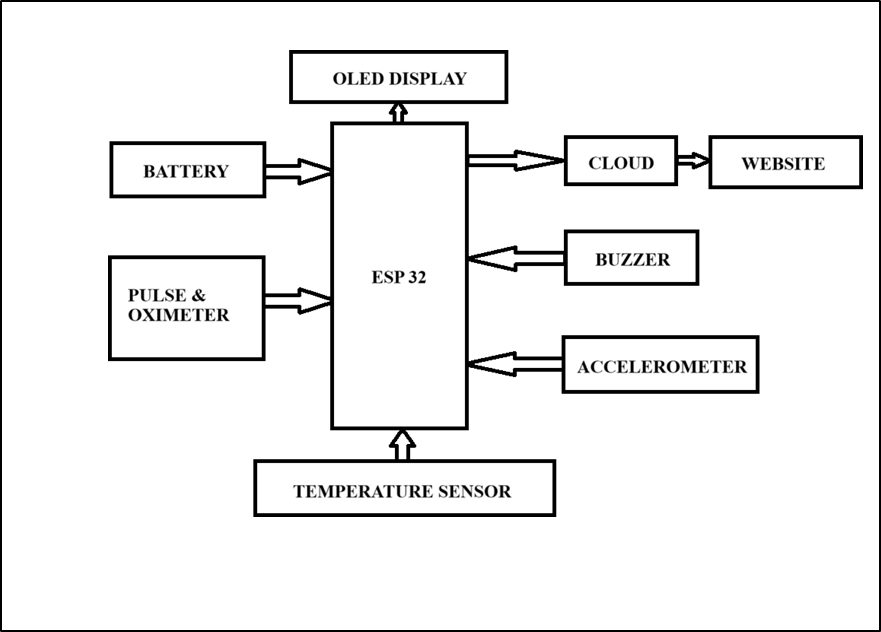
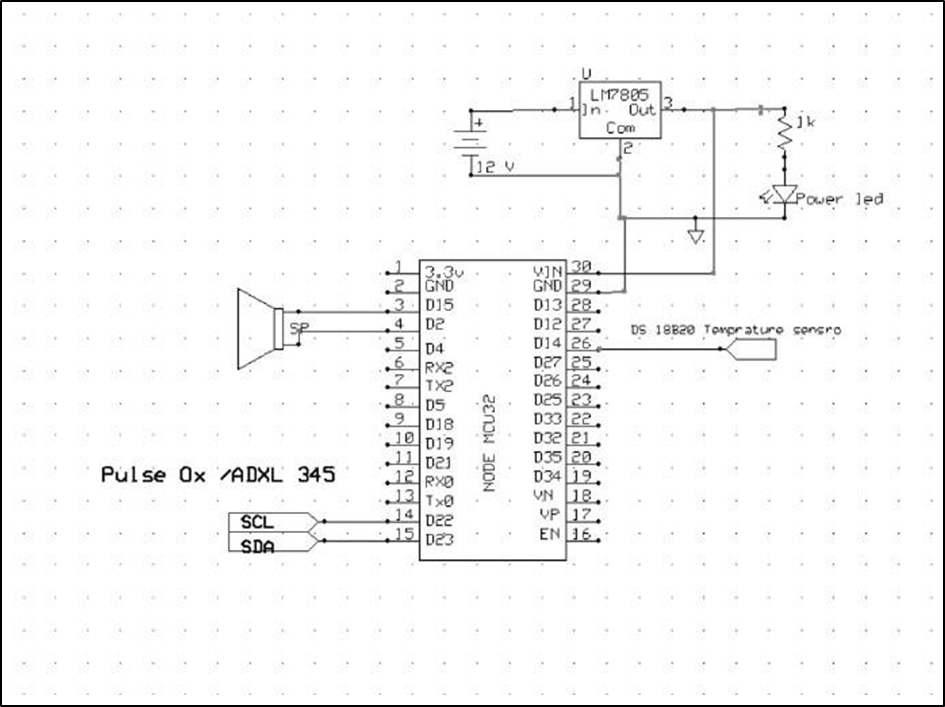
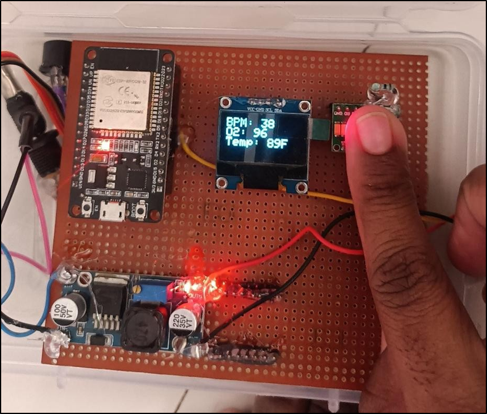
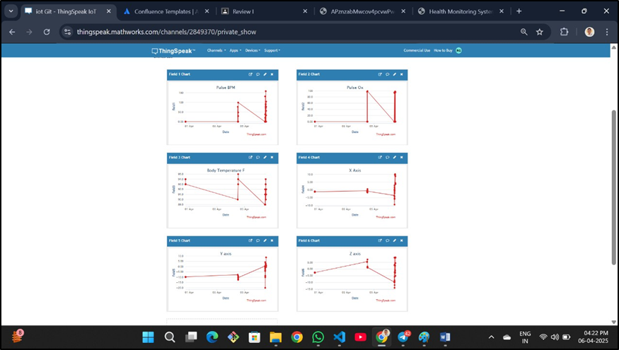
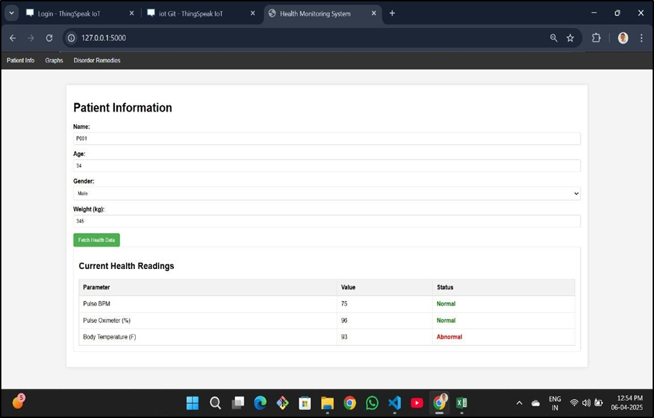
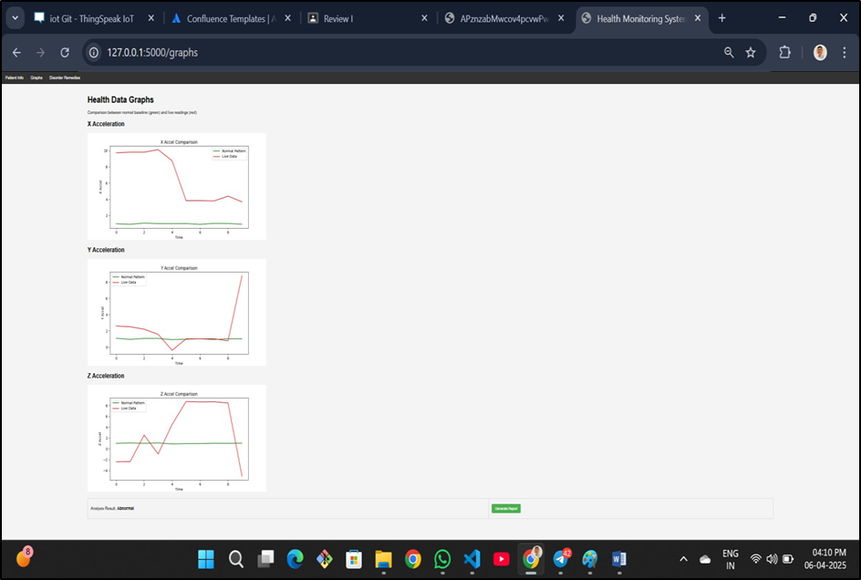
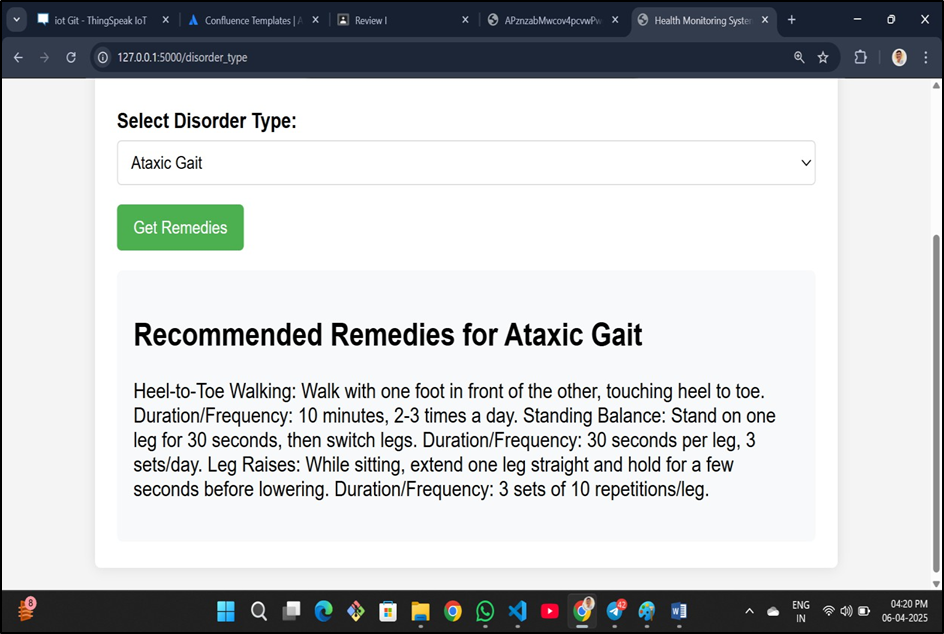

## 🎯 Project Title  

# 📘 IoT-Based Gait Disorder Detection and Health Monitoring System

## 📄 Description  
This project presents a real-time, wearable IoT system to monitor vital health parameters and detect gait disorders in patients recovering from surgeries, neurological conditions, or injuries. Using an ESP32 microcontroller, it integrates sensors like MAX30100 (pulse & SpO₂), LM35 (temperature), and ADXL345 (accelerometer) to collect live physiological and motion data. The data is displayed on an OLED and sent to ThingSpeak cloud, then analyzed through a Flask web application to classify gait and detect abnormalities. The system also includes a buzzer to alert in case of abnormal readings, helping ensure patient safety during recovery.

## ⚙️ Features
- Real-time monitoring of BPM, SpO₂, body temperature, and leg motion
- Wi-Fi data transmission to ThingSpeak cloud using ESP32
- Flask-based web dashboard for live monitoring and classification
- Dataset-based gait disorder detection using accelerometer values
- OLED display for local feedback
- Buzzer alert system for abnormalities

## 🔌 Hardware Components
- **ESP32 Microcontroller** (central controller with Wi-Fi)
- **MAX30100** Pulse & SpO₂ Sensor
- **DS18B20** Temperature Sensor
- **ADXL345** Accelerometer (mounted on leg)
- **OLED Display** (0.96” I2C)
- **Buzzer** (for real-time alerts)
- **LM7805** Voltage Regulator
- **Li-ion Battery** (3.7V, 2000mAh)

## 🧠 Software Stack
| Component      | Technology Used          |
|----------------|--------------------------|
| Embedded Code  | Arduino IDE (C++)        |
| Web Dashboard  | Python Flask             |
| Data Storage   | ThingSpeak (Cloud API)   |
| Visualization  | Matplotlib + HTML (Flask Templates) |
| Dataset        | CSV (normal_data1.csv) for gait classification |

## Block Diagram and Circuit Diagram

## 📊 Gait Classification Logic
- ADXL345 captures X, Y, Z acceleration values.
- Flask compares them with pre-labeled gait dataset using Euclidean distance.
- Classifies gait as **Normal**, **Abnormal**, or specific disorder (e.g., Parkinsonian, Spastic).
- Suggests remedy based on dataset's `Recovery_Suggestion`.

## 🖥️ Web Interface Features
- Live display of BPM, SpO₂, Temperature, X/Y/Z
- Color-coded status: **Normal**, **Abnormal**, **Disorder**
- Gait comparison graphs with mean ± std shading
- Disorder-specific remedies page

## 🧪 Testing & Results
- Sensors tested with real-time patient movement and vital sign variations
- System reliably detected disorders like Ataxic Gait and triggered alerts
- Usability tested with patients, physiotherapists, and caregivers
- OLED readability and Flask interface validated for home and clinical use

## Hardware Result 

## Cloud Result

## Software Result:-

## 1.WEBSITE PATIENT INFORMATION PAGE

## 2.Patient’s Health Data Graphs

## 3.Disorder Remedies Page

## 🔐 Safety Features
- Buzzer alerts for:
  - BPM out of 50–120
  - SpO₂ < 95%
  - Temp < 97°F or > 99°F
  - Abnormal gait pattern
- Wireless monitoring avoids unnecessary hospital visits

## 📱 Future Scope
- AI/ML-based gait classification model
- Mobile app for remote monitoring and alerts
- EMG and additional sensor integration
- Long-term patient data trends and predictive analytics

## 👨‍🔧 Project Team
- **Group No:** 3  
- **Guide:** Prof. Karle Sir  
- **College:** Sinhagad Institute of Technology  
- **Team Members:** 4
